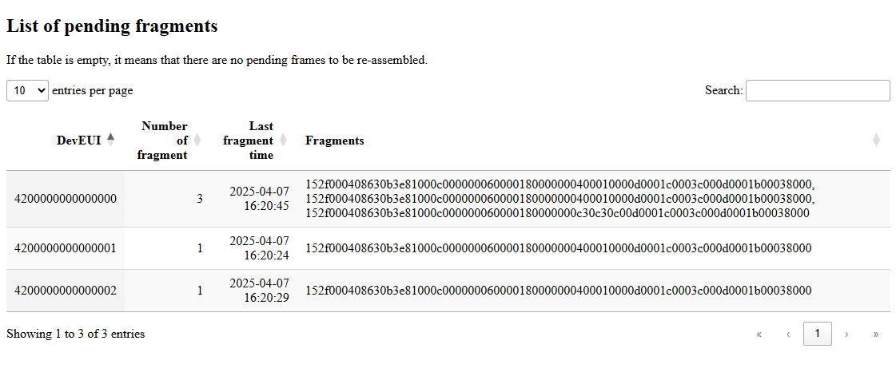
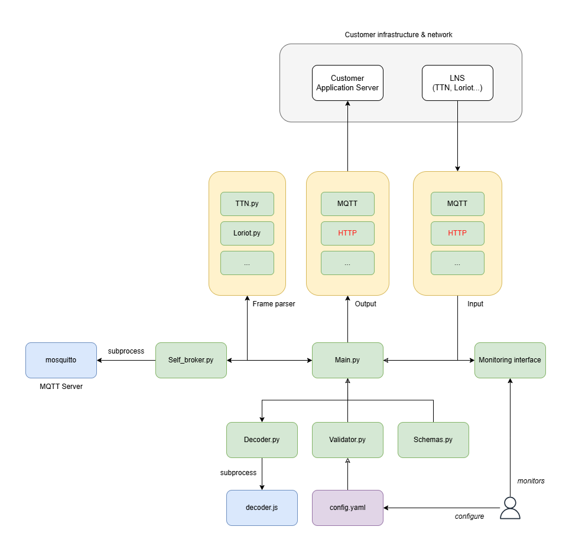

# FrameWeaver

[](https://github.com/TEConnectivity/FrameWeaver/actions/workflows/docker-build-push.yaml)

⚠️ **Currently under active development – not production-ready!**

FrameWeaver processes and decodes fragmented LoRaWAN frames received via MQTT or HTTP, reassembles them, and publishes the decoded output to your configured destination.

🚀 Features:

- Input support: MQTT and HTTP
- Output support: MQTT (HTTP coming soon)
- In-memory reassembly of fragments
- Flexible decoding via custom script
- Built-in monitoring web UI
- Self-hosted MQTT broker support
- Fully configurable via [`config.yaml`](/src/app/config.yaml)

## LNS

Since each LNS has its own specific format, FrameWeaver is only compatible with the following LNS :

- TTN
- Loriot

## Input

The following inputs are available :

- MQTT : Listen from incoming MQTT messages from the specified Topic. Can be connected to a remote MQTT broker or the self-hosted one.


## Output

The following outputs are available :

- MQTT : Output fully decoded message to the output topic configured in `config.yaml`

## Hosted MQTT Broker

If no MQTT Broker is available on the network, FrameWeaver can host it. To make use of it, configure the MQTT input & output to `localhost` 

# Usage

A docker image is already available to be used, hosted on Github Container Registry :

    docker run -p 1883:1883 -p 8080:8080 ghcr.io/teconnectivity/frameweaver


A slim version with a hugely reduced size is also available : [frameweaver.slim](https://github.com/TEConnectivity/FrameWeaver/pkgs/container/frameweaver.slim) Please note that this version, while based on the main one, is less tested. 


## Run instructions

Run with all default settings (default [config](/src/app/config.yaml)) :

    docker run -p 1883:1883 -p 8080:8080 frameweaver

FrameWeaver can also be run with a custom config, by mounting it. Assuming your `custom_config.yaml` is inside your current working directory :

    docker run -v $(pwd)/custom_config.yaml:/app/app/config.yaml -p 1883:1883 -p 8080:8080 frameweaver


## Docker Compose

An example [docker-compose.yaml](/docker-compose.yml) is provided. A custom config can be easily used through volume : 

```
    volumes:
      - ./custom_config.yaml:/app/app/config.yaml
```


# Monitoring interface

A Web Interface is available to monitor which frames are pending for which devices : 



# Software architecture




# Sizing

For the docker deployment, container should have the following sizing :

- CPU : 1 Core
- RAM : 256 MB
- Network : 1 Mbps
- Disk space : No disk usage. Everything is stored in-memory


# Test

Tests dependencies are listed in the `requirements.txt` file under `tests` folder.
Tests should always be run inside the `tests` folder for proper initialization.


# Limitations

Stress tests shows the following :
    - At very high load (thousands of different devEUI over a minute) : 
      - Monitor interface can fail because the `frame_buffer` object is being rendered to front-end and modified in same time.
      - Self-hosted MQTT broker can crash (mosquitto process)
    - For a very high number of pending fragment (100k different devEUI) : Monitor interface can take up to 1 mn to fully load, because everything is displayed in the front-end.


## Build instructions

Assuming a Linux system, with `docker` command installed:

    cd src
    docker build -t frameweaver .


### Slim version

To reduce the size of the generated image, a slim version can be created. The use of the official [slimtoolkit](https://github.com/slimtoolkit/slim) is recommended.   

Based on an existing image, assuming a config_dev.yaml present on your filesystem, use the following command :

    slim build  --mount $(pwd)/app/config_dev.yaml:/app/app/config.yaml --publish-port 1883:1883 --publish-port 8080:8080 --publish-exposed-ports --http-probe=false  frameweaver

HTTP Probe are disabled because FrameWeaver expose different services than HTTP, so we don't want slim to restrain itself to those protocols. Once the command is running, play extensively with the container so that slim detect all its running dependencies : mosquitto, javascript decoder... You want a config file that enable as many of these services as possible, otherwise they will be deleted during slim image creation.


# Roadmap

- HTTP Input/Output
- Do some modularization to allow interfacing multiple decoders
- Multi-stage docker to remove NPM dependencies (which add few hundreds of MB to the image size)